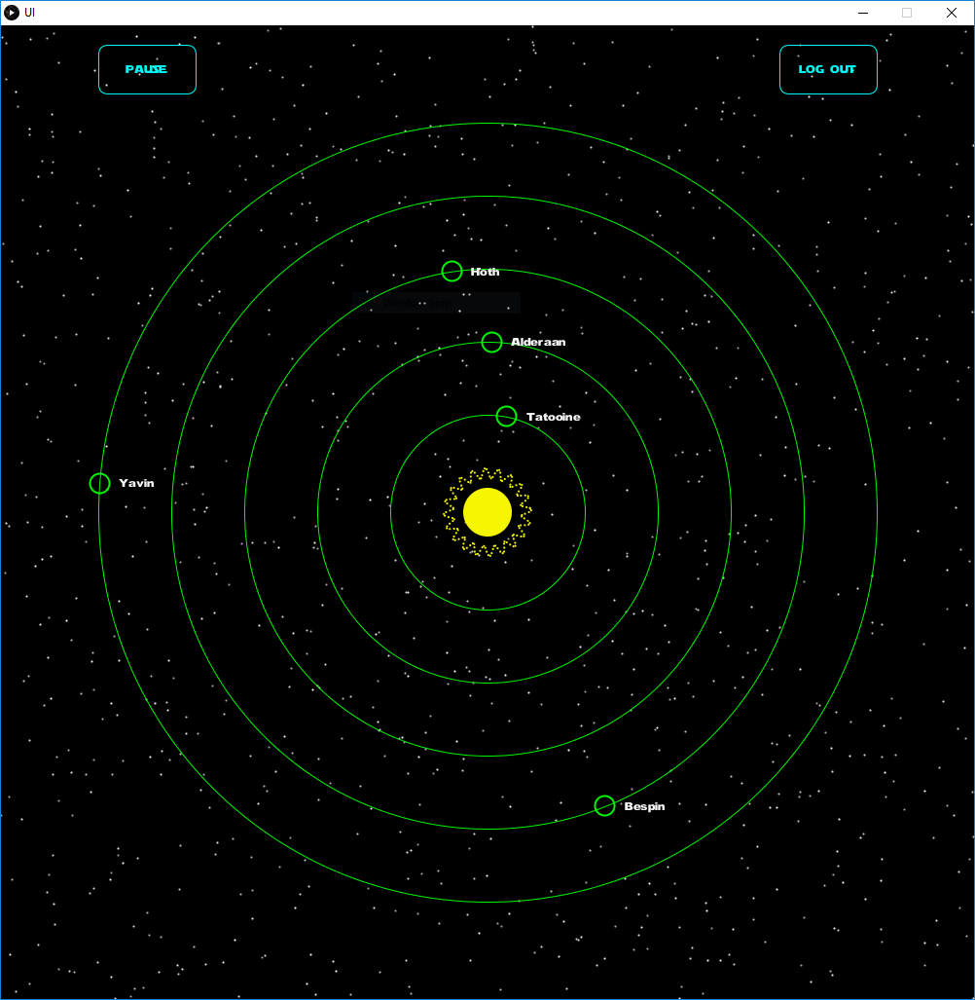
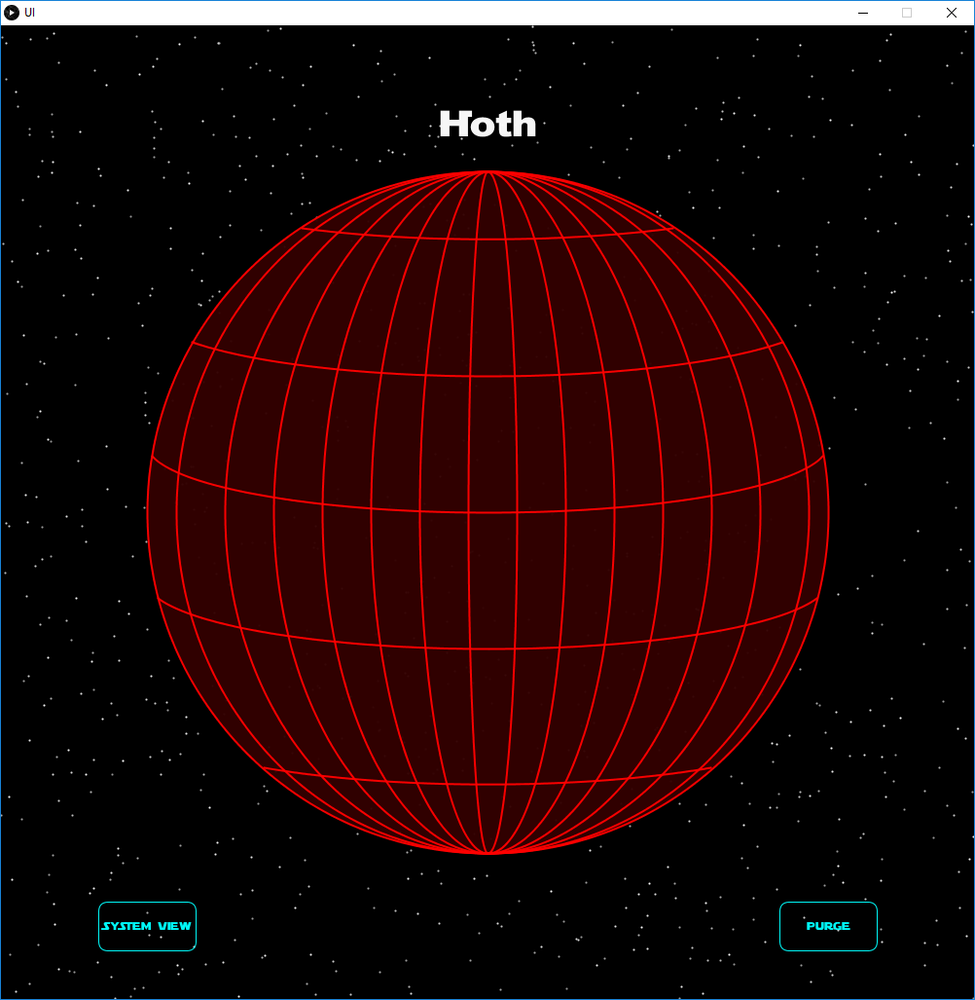
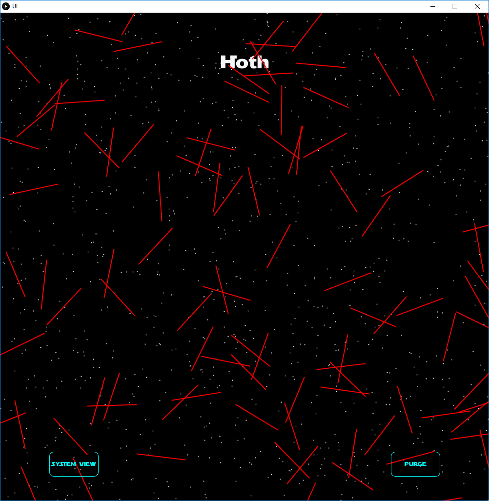
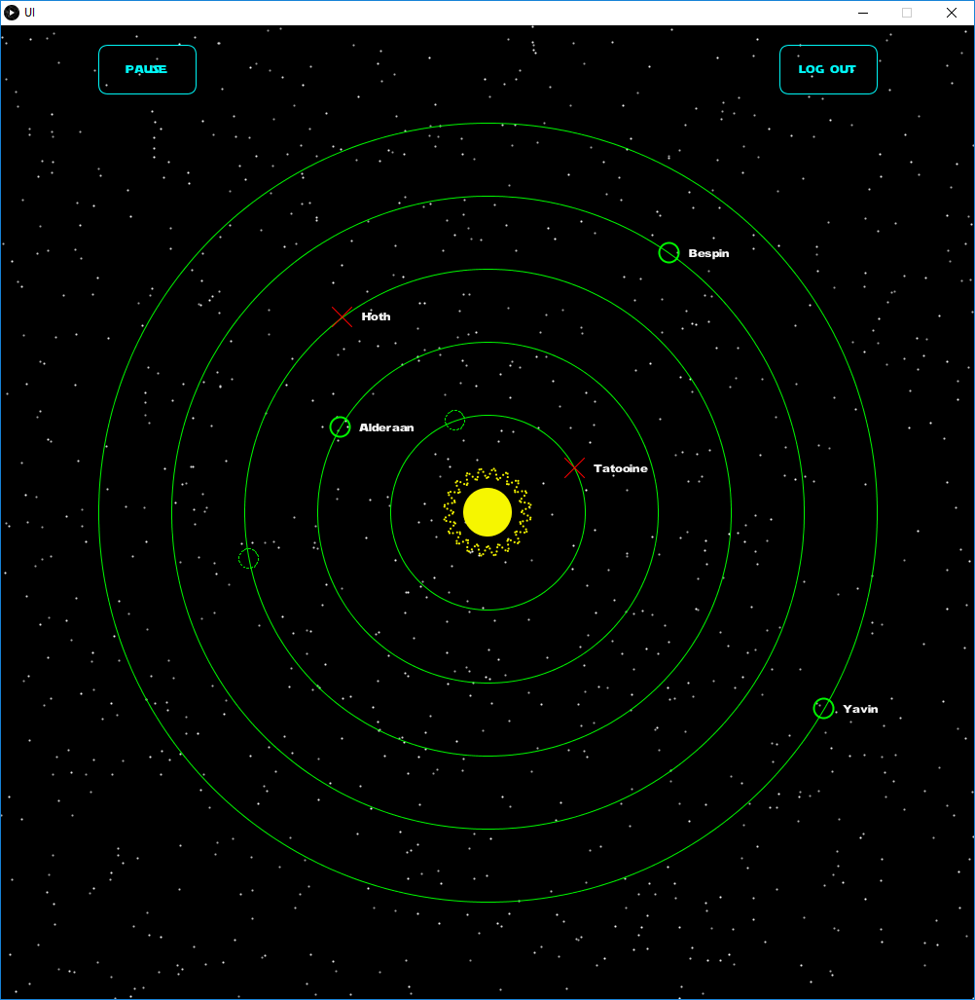

# Assignment for OOP: Sci-Fi UI
Name: Pádraig Redmond

Student Number: C15755659

## Video

## Screenshots
### System view

### Large planet view

### Exploding planet

### System post-purge

## Description
NOTE: If you're running the program several times, replace intro.txt with a blank text file to avoid having to wait through the opening sequence each time.

### Introduction
I planned very early for my UI to be based on a solar system. I created an [experimental project](https://github.com/Red350/Solar_system_experiment) in the first few weeks of the module, which consisted of a solar system simulation that could be sped up, slowed down, and even reversed. I ended up starting completely from scratch with the actual assingnment, though I learned a lot from that which I applied to the current version.

This UI is loosely inspired by Star Wars, mostly just the names and the idea of blowing up planets. It's intended to be a computer system on the death star, with the screen being a window out to space, which is why there are always stars visible in the background.

### String Parser
To give the illusion of typed text, I wrote a string parsing class. It effectively prints characters to the screen at a set rate, but also adds the functionality of delay and backspace.

The '^' symbol, followed by two numbers, e.g. "^10" is used to make the terminal wait before adding more characters to the display string. During this wait time an underscore is added and removed from the display string to make it look like the cursor is flashing, waiting for input. The delay number must be even, and the delay time is equivalent to half the delay number in seconds, so "^10" would wait for 5 seconds.

A '$' character is interpreted as a backspace, and will clear text already printed to the screen.

### Colour Fade
Every screen transition fades the old screen out and the new screen in, which posed a bit of a challenge due to how processing handles colours.

Colours in processing are not objects, they are simply 32 bit integers, with 2 bytes each referring to the alpha and RGB values of the colour in the following format: AARRGGBB. This made fading colours in and out a bit more complicated than I thought it would be.

I wrote a colour handler class that can be used to set the rgb or alpha of a colour to a specific value. It uses bit operations on a processing color value to clear the relevant bits and then set them to the new value.
# Assignment for OOP: Sci-Fi UI
Name: Pádraig Redmond

Student Number: C15755659

## Video

## Screenshots
### System view

### Large planet view

### Exploding planet

### System post-purge

## Description
NOTE: If you're running the program several times, replace intro.txt with a blank text file to avoid having to wait through the opening sequence each time.

### Introduction
I planned very early for my UI to be based on a solar system. I created an [experimental project](https://github.com/Red350/Solar_system_experiment) in the first few weeks of the module, which consisted of a solar system simulation that could be sped up, slowed down, and even reversed. I ended up starting completely from scratch with the actual assingnment, though I learned a lot from that which I applied to the current version.

This UI is loosely inspired by Star Wars, mostly just the names and the idea of blowing up planets. It's intended to be a computer system on the death star, with the screen being a window out to space, which is why there are always stars visible in the background.

### String Parser
To give the illusion of typed text, I wrote a string parsing class. It effectively prints characters to the screen at a set rate, but also adds the functionality of delay and backspace.

The '^' symbol, followed by two numbers, e.g. "^10" is used to make the terminal wait before adding more characters to the display string. During this wait time an underscore is added and removed from the display string to make it look like the cursor is flashing, waiting for input. The delay number must be even, and the delay time is equivalent to half the delay number in seconds, so "^10" would wait for 5 seconds.

A '$' character is interpreted as a backspace, and will clear text already printed to the screen.

### Colour Fade
Every screen transition fades the old screen out and the new screen in, which posed a bit of a challenge due to how processing handles colours.

Colours in processing are not objects, they are simply 32 bit integers, with 2 bytes each referring to the alpha and RGB values of the colour in the following format: AARRGGBB. This made fading colours in and out a bit more complicated than I thought it would be.

I wrote a colour handler class that can be used to set the rgb or alpha of a colour to a specific value. It uses bit operations on a processing color value to clear the relevant bits and then set them to the new value.

Each screen has an associated ColorHandler array that stores any colour used for that screen. When fading, there are two other arrays, fadeIn and fadeOut, which unsurprisingly point to the respective arrays to be faded in and out.

### Sun
The sun in the centre of the system view consists of a circle, surrounded by 150 "satellite" circles. Each satellite remains at a static angle relative to the centre point of the sun, but appears to rotate in a sin wave pattern around the sun. Changing some of the fields in the sun class, such as numPeaks, can result in very interesting patterns.

### Large planet
The large planet view is intended to give the illusion of a 3d rotating planet, using only 2d drawing.

The rotation consists of arcs, all of which have a centre point at the centre of the planet and end points at each of the poles. The arcs either shrink or grow their width by 1 pixel every frame depending on which side of the planet they are on. After 100 frames, they move back to their starting position and begin moving over the same 100 pixel range again. Since they are all spaced by 100 pixels, and as they all move at the same time, it gives the illusion that each arc travels the full width of the planet, though this is not the case.

## Asset Credits

### Font
* Star wars font - [STARWARS.TTF](http://www.fonts2u.com/starwars.font) by Jose Gonzalez Pareja

### Audio
* Background music - [deepspace.mp3](https://www.freesound.org/people/keinzweiter/sounds/161615/) by keinzweiter
* Background music - [space1.mp3](https://www.freesound.org/people/alaupas/sounds/176685/) by alaupas
* Button click - https://www.freesound.org/people/kwahmah_02/sounds/256116/ by kwahmah_02
* Button mouse over - https://www.freesound.org/people/DrMinky/sounds/166186/ by DrMinky